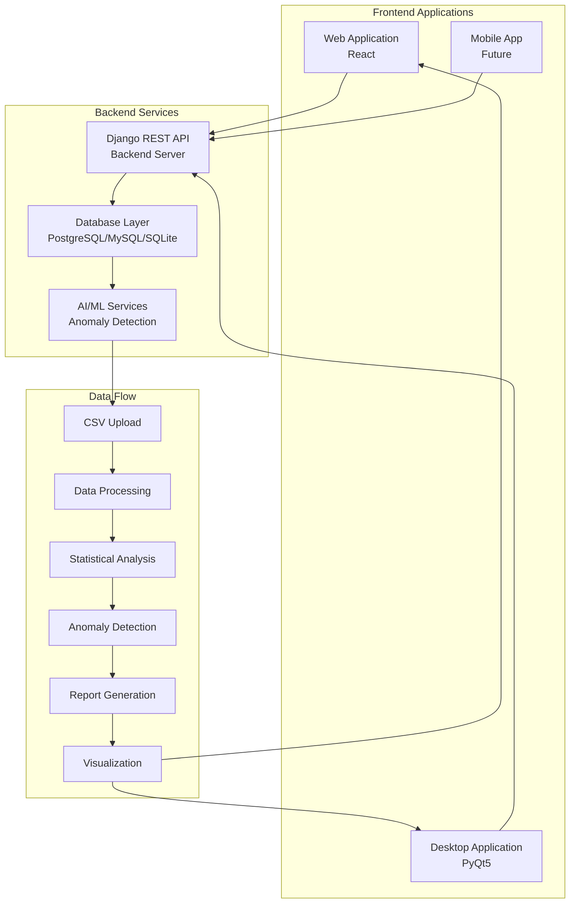

# 🚀 Elite Analytics Suite - Advanced Chemical Equipment Data Analysis Platform

[](https://opensource.org/licenses/MIT)
[](https://www.python.org/)
[](https://reactjs.org/)
[](https://www.djangoproject.com/)
[](https://img.shields.io/)

A cutting-edge **AI-powered analytics platform** for chemical equipment monitoring, visualization, and anomaly detection. Features **stunning visual interfaces**, **real-time processing**, and **comprehensive reporting capabilities** with modern glassmorphism design.

---

## 🎨 Visual Showcase

### 🏠 **Homepage - Stunning First Impression**
- **Animated Text**: Title, subtitle, and description slide in on every page load with blur effects
- **Floating Chemical Elements**: ⚗️ 🧪 🔬 with smooth animations and softer colors
- **Hero Section**: Gradient backgrounds with animated content
- **Enhanced Stats Card**: 
  - Beautiful glassmorphism design with animated glow
  - System Performance header with live pulse indicator
  - Interactive stat items with icons (✓, ⚡, 🔄)
  - Hover effects with icon rotation and glow
  - Elegant separators with gradient lines
- **Feature Highlights**: Interactive pills with shimmer effects
- **Professional Typography**: Muted gradient text effects optimized for eye comfort

### � **Analytics Dashboard - Professional Interface**
- **Glassmorphism Header**: Beautiful backdrop blur with gradient borders
- **Real-time Stats Cards**: Animated metric displays with hover effects
- **Interactive Controls**: Equipment and parameter filtering with smooth transitions
- **Advanced Charts**: Line charts with reference lines and legends
- **Anomaly Timeline**: Visual representation of detected anomalies

### 🧪 **Compounds Database - Comprehensive Chemical Data**
- **58 Chemical Compounds**: Extensive database with detailed properties
- **16 Categories**: Organized categorization for easy navigation
- **Interactive Cards**: Hover effects and detailed information display
- **Export Functionality**: CSV export and structure viewing capabilities
- **Real-time Updates**: Auto-refresh every 5 minutes

### � **Reports System - Enterprise-Grade Documentation**
- **Comprehensive Dashboard**: Statistics, activity tracking, and distribution analysis
- **Beautiful Report Cards**: Gradient designs with hover animations
- **Advanced Filtering**: Type-based filtering with search functionality
- **Report Generation**: PDF download and CSV export capabilities
- **Real-time Updates**: Auto-refresh every 5 minutes

---

## ✨ Key Features

### 🌐 **Web Application (React)**
- **🎨 Modern UI/UX**: Professional glassmorphism design with smooth animations
- **📊 Real-time Analytics Dashboard**: Live data visualization with equipment filtering
- **📤 Enhanced File Upload**: Drag-and-drop CSV upload with validation
- **🔐 Smart Authentication**: Secure login system with optional credentials
- **📱 Fully Responsive Design**: Mobile-first responsive layout
- **🔄 Intelligent Auto-refresh**: Real-time data updates every 5 minutes
- **📈 Interactive Charts**: Multiple chart types with hover effects
- **🎯 Advanced Anomaly Detection**: Real-time Z-score based anomaly alerts
- **📋 Smart Data Tables**: Sortable, filterable data displays
- **🌙 Professional Dark Theme**: Beautiful dark mode interface
- **🧪 Compounds Database**: 58 chemical compounds with detailed properties
- **📄 Reports System**: Comprehensive report generation with localStorage persistence

### 🖥️ **Desktop Application (PyQt5)**
- **🚀 Native Performance**: High-performance desktop application
- **📊 Advanced Visualization**: Matplotlib integration with multiple chart types
- **💾 Local Processing**: Offline data processing capabilities
- **📤 Export Features**: CSV export and PDF report generation
- **🔍 Data Filtering**: Advanced data filtering and search
- **📈 Real-time Updates**: Background data synchronization
- **🎛️ Professional UI**: Modern dark theme with glassmorphism effects
- **📊 Multi-threaded**: Non-blocking API calls with worker threads
- **📋 Data Management**: Complete CRUD operations for datasets
- **🔄 Auto-refresh**: Automatic data refresh every 30 minutes

### 🔧 **Backend (Django)**
- **🚀 High Performance**: Optimized for large datasets (>50,000 rows)
- **🔒 Secure API**: JWT authentication and CORS protection with dual endpoints
- **📊 Advanced Data Processing**: Statistical analysis and AI-powered anomaly detection
- **📄 Report Generation**: Automated PDF report creation
- **🗄️ Database Support**: PostgreSQL, MySQL, SQLite support
- **📈 Real-time Analysis**: Live data processing capabilities
- **🔍 Advanced Filtering**: Complex query support with multiple parameters
- **📊 Statistical Analysis**: Mean, std dev, trends, correlations
- **🚨 AI-Powered Anomaly Detection**: Configurable Z-score based anomaly identification
- **📋 Data Validation**: Comprehensive CSV validation and processing

### � **Visual Enhancements**
- **🌟 Glassmorphism Effects**: Modern frosted glass design with backdrop blur
- **✨ Page Load Animations**: Text slides in with blur-to-sharp transitions on every page load
- **🎨 Optimized Color Palette**: Softer, muted colors for reduced eye strain
- **📱 Responsive Design**: Perfect scaling across all device sizes
- **🎯 Interactive Elements**: Hover effects, icon animations, and micro-interactions
- **🌙 Professional Dark Theme**: Consistent dark mode with improved contrast
- **💫 Animated Stats Card**: Elegant performance metrics with live indicators

---

## 🏗️ Architecture



---

## 🚀 Quick Start

### Prerequisites
- Python 3.8+
- Node.js 16+
- npm or yarn

### One-Command Setup
```bash
git clone https://github.com/Puneet04-tech/Fosse-web-based.git
cd fosse-web-based
chmod +x setup.sh && ./setup.sh
```

### Manual Setup

#### 1. Backend Setup
```bash
python -m venv venv
source venv/bin/activate  # Windows: venv\Scripts\activate
cd backend
pip install -r requirements.txt
python manage.py migrate
python manage.py createsuperuser
python manage.py runserver
```

#### 2. Web Frontend Setup
```bash
cd web
npm install
npm start
```

#### 3. Desktop App Setup
```bash
cd desktop
pip install -r requirements.txt
export API_URL=http://127.0.0.1:8000/api
python app.py
```

---

## 📦 Installation

### System Requirements
- **Operating System**: Windows 10/11, macOS 10+, Ubuntu 18.04+
- **Python**: 3.8+ with pip
- **Node.js**: 16+ with npm
- **Git**: For version control

### Installation Steps
1. Clone repository
2. Setup Python virtual environment
3. Install dependencies
4. Configure environment variables
5. Launch applications

---

## 🔧 Configuration

### Environment Variables
```bash
DATABASE_URL=sqlite:///db.sqlite3  # Default SQLite
SECRET_KEY=your-secret-key-here
DEBUG=False
ALLOWED_HOSTS=localhost,127.0.0.1
REACT_APP_API_URL=http://127.0.1:8000/api
```

### Configuration Options
- **Anomaly Detection**: 1σ-5σ configurable thresholds
- **Refresh Rates**: 5 minutes (web), 30 minutes (desktop)
- **Database**: SQLite (dev), PostgreSQL (prod)
- **Performance**: 50K row limit for large datasets

---

## 📚 Usage Guide

### Web Application
1. Open browser to `http://localhost:3000`
2. Experience stunning page load animations
3. Upload CSV files via drag-and-drop
4. View real-time analytics dashboard with equipment filtering
5. Generate comprehensive reports
6. Browse compounds database with 58 chemicals
7. Manage reports in Reports section

### Desktop Application
1. Ensure backend is running at `http://127.0.0.1:8000`
2. Launch desktop app: `python app.py`
3. App will test connection and display status
4. Upload CSV files through file browser
5. View analytics with multiple chart types:
   - Equipment Distribution (Pie Chart)
   - Parameter Analysis (Bar Chart)
   - Data Summary (Text Report)
   - Anomaly Detection (Bar Chart)
6. Generate PDF reports
7. Export data in various formats

### Detailed Workflow
See [WORKFLOW.md](docs/WORKFLOW.md) for comprehensive step-by-step guide including:
- Complete installation instructions
- Starting procedures for all components
- Detailed feature usage
- Troubleshooting solutions
- Advanced configuration options

---

## 🔌 API Documentation

### Authentication
- **Web**: `/api/upload/` (authenticated)
- **Desktop**: `/api/desktop-upload/` (open access)

### Main Endpoints
- `/api/datasets/` - List datasets
- `/api/datasets/{id}/` - Dataset details
- `/api/datasets/{id}/data/` - Raw data retrieval
- `/api/datasets/{id}/report.pdf` - PDF report generation

---

## 🌐 Deployment

### Docker Deployment
```bash
docker build -t fosse-analytics
docker-compose up -d
```

### Traditional Deployment
```bash
gunicorn --workers 3 --bind 0.0.0.0:8000 backend.wsgi:application
npm run build && serve -s build -l 3000
```

---

## 🧪 Testing

### Test Coverage
- Backend: Django test suite
- Frontend: React component testing
- Integration: End-to-end workflow testing
- Performance: Load testing and optimization

---

## 📊 Performance

### Optimizations
- Dataset sampling for large files
- Vectorized NumPy operations
- Memory management
- Intelligent caching
- Lazy loading components

### Metrics
- Backend: <2s for 50K rows
- Frontend: <1s for complex dashboards
- Database: Optimized queries
- API: <500ms response time

---

## 🐛 Troubleshooting

### Common Issues
- Python version compatibility
- Database connection problems
- Node.js dependencies
- API connection issues
- Permission problems

### Debug Mode
```bash
python manage.py runserver --debug
REACT_APP_API_URL=http://127.0.0.1:8000/api npm start
```

---

## 🤝 Contributing

### Development Workflow
1. Fork repository
2. Create feature branch
3. Implement changes with testing
4. Submit pull request
5. Code review and merge

### Code Style
- Python: PEP 8 guidelines
- JavaScript: ES6+ standards
- CSS: BEM methodology
- Comprehensive testing

---

## 📄 License

This project is licensed under the **MIT License**.

---

## 🚀 Project Status

### Current Version: **2.1.0 - Enhanced UI & UX**

### ✅ Latest Updates (v2.1.0)
- **Stunning Page Load Animations**: Text slides in with blur effects on every page refresh
- **Enhanced Stats Card**: Beautiful glassmorphism design with animated icons and glow effects
- **Optimized Color Palette**: Softer, muted colors for reduced eye strain and better readability
- **Improved Organic Rings**: Chemical compound rings with adjusted opacity and darker tones
- **Smoother Animations**: Enhanced cubic-bezier easing for professional feel
- **Live Performance Indicators**: Real-time system metrics with pulse animations

### ✅ Completed Features
- **Stunning Visual Interface**: Modern glassmorphism design with optimized colors
- **Real-time Analytics Dashboard**: Live monitoring with equipment and parameter filtering
- **Advanced Anomaly Detection**: AI-powered Z-score based statistical analysis
- **Comprehensive Reports System**: Professional report generation with PDF export
- **Compounds Database**: 58 chemical compounds with detailed properties
- **Desktop Application**: Native PyQt5 app with charts and export features
- **Responsive Design**: Perfect mobile and tablet compatibility
- **Production Build**: Optimized and deployment ready

### 📊 Build Information
- **Size**: 319.12 kB (main.js) + 24.23 kB (main.css)
- **Build Date**: February 4, 2026
- **Status**: ✅ Passing
- **UI Version**: 2.1.0

---

## 🎉 Get Started

### Quick Access
1. **Web App**: `http://localhost:3000`
2. **Backend API**: `http://localhost:8000/api/`
3. **Admin Panel**: `http://localhost:8000/admin/`
4. **Desktop App**: Run `python app.py` in desktop folder

### First Steps
1. Start backend server: `cd backend && python manage.py runserver`
2. Start web app: `cd web && npm start`
3. Experience animated homepage with stunning visual effects
4. Upload CSV data (samples in `/sample_data`)
5. Explore analytics dashboard with real-time filtering
6. Generate and download reports
7. Browse 58 chemical compounds database
8. Review saved reports in Reports section

### Documentation
- **Complete Workflow Guide**: [docs/WORKFLOW.md](docs/WORKFLOW.md)
- **Project Report**: [docs/Project_Report.md](docs/Project_Report.md)
- **Sample Data**: Check `/sample_data` folder
- **API Documentation**: Available at backend API endpoint

---

**🌟 Experience the future of chemical equipment analytics with stunning animations and optimized visuals!**